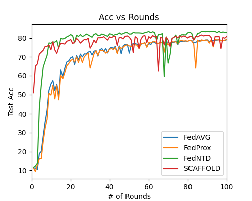
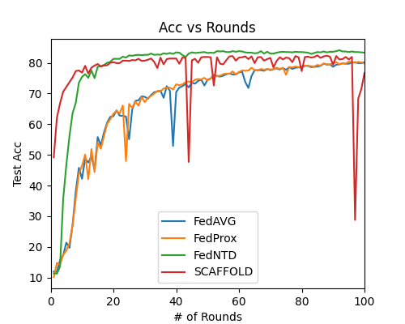
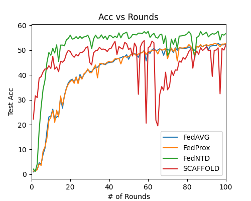
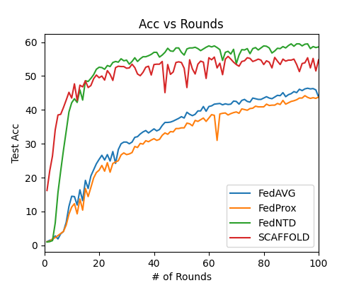

# Regularizing Federated Learning via adversarial model perturbations

## Procedure

### We regularize FL algorithms using Adversarial Model Perturbations (AMP) regularizer

### We implement 4 algorithm for FL from scratch

- FedAVG
- FedProx
- FedNTD
- SCAFFOLD

### Dependencies are given in requirement.txt file

```
pip install -r requirements.txt
```

### How to RUN

**Choose the required YAML file and run the following commands**

```
python scaffold.py configs/scaffold_c100_amp.yaml > logfiles/scaffold_c100_amp.log
python fedntd.py configs/fedntd_c100_amp.yaml > logfiles/fedntd_c100_amp.log
python fedprox.py configs/fedprox_c100_amp.yaml > logfiles/fedprox_c100_amp.log
python fedavg.py configs/fedavg_c100_amp.yaml > logfiles/fedavg_c100_amp.log
```

## Results

### **Comparsion of FL algorithms on CIFAR10 dataset**

**Comparison without AMP regularizer**



**Comparison with AMP regularizer**



### **Comparsion of FL algorithms on CIFAR100 dataset**

**Comparison without AMP regularizer**



**Comparison with AMP regularizer**



## Members

- Gautam Kumar (B19EE031)
- Nirbhay Sharma (B19CSE114)
